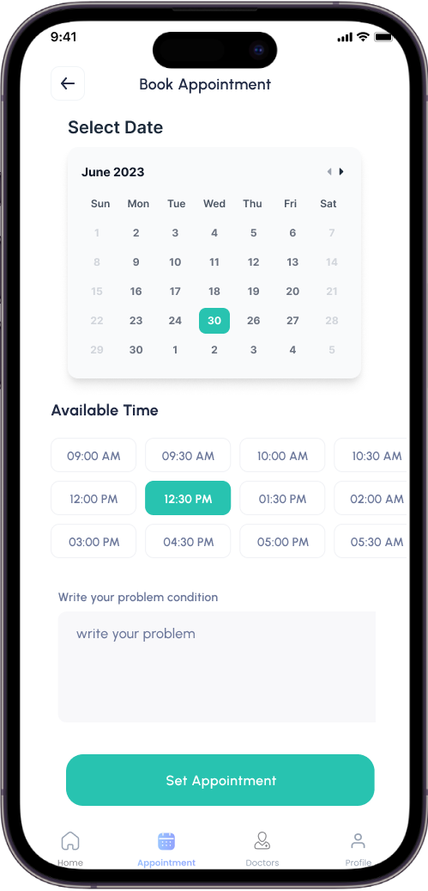

# Deap - Dentist Appointment App

Deap is a mobile application that simplifies the process of scheduling and managing dental appointments. Users can easily find and book appointments with dentists, manage their schedules, and leave reviews based on their experiences.

## Features

- **Specialization Selection**: Users can select the specialization of the dentist they wish to visit.
- **Appointment Booking**: Book appointments with dentists based on availability.
- **User Management**: Manage user accounts and preferences.
- **Review and Rating**: Users can leave reviews and provide ratings for dentists.
- **Doctor Details**: View detailed information about dentists, including their experiences, ratings, performances, working hours, and conditions they can treat.

## Getting Started

To get started with Deap, follow these steps:

1. Clone the repository: `git clone https://github.com/6531503042/Deap-Mobile-Application.git`
2. Install dependencies: `flutter pub get`
3. Run the application: `flutter run`

## Technologies Used

- Flutter for the mobile application development
- Firebase for backend services such as authentication and database management

## Technologies Used

- Flutter for the mobile application development
- Firebase for backend services such as authentication and database management

## Contributing

We welcome contributions to Deap! To contribute, follow these steps:

1. Fork the repository
2. Create a new branch (`git checkout -b feature/new-feature`)
3. Commit your changes (`git commit -am 'Add new feature'`)
4. Push to the branch (`git push origin feature/new-feature`)
5. Create a new Pull Request

## License

This project is licensed under the MIT License - see the [LICENSE](LICENSE) file for details.

## Contact

For any questions or suggestions regarding Deap, please contact us at [your-email@example.com](mailto:your-email@example.com).

---

Beta Andriod APK Package Test File 
Download-Link: https://drive.google.com/file/d/13Gbb_8jHFASv8moMm_QCKwPmfm-GzzzO/view?usp=sharing
